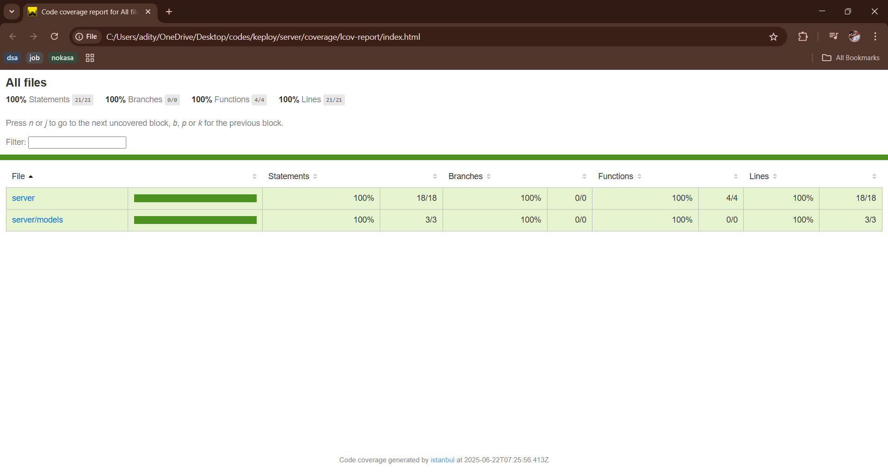

# 🧪 Custom API Server with MongoDB and Node.js

This project is a custom API server built using **Node.js**, **Express**, and **MongoDB**. It supports full CRUD operations on a `User` model and includes automated tests with code coverage reporting.

---

## 🧠 Technologies Used

- **Node.js**
- **Express.js**
- **MongoDB** (with Mongoose)
- **VS Code** (development)
- **Thunder Client / Postman** (API testing)
- **Jest** + **Supertest** (unit/integration/API testing)

---

## 📡 API Endpoints

| Method | Endpoint         | Description             |
|--------|------------------|-------------------------|
| GET    | `/api/users`     | Get all users           |
| POST   | `/api/users`     | Add a new user          |
| PUT    | `/api/users/:id` | Update an existing user |
| DELETE | `/api/users/:id` | Delete a user           |

---

### 📤 Sample Request

**POST /api/users**
```json
{
  "name": "Aditya",
  "email": "aditya@example.com",
  "age": 22
}
````

### 📥 Sample Response

**GET /api/users**

```json
[
  {
    "_id": "609d...",
    "name": "Aditya",
    "email": "aditya@example.com",
    "age": 22
  }
]
```

---

## 🗃️ Database

* **MongoDB Community Edition** used locally
* Connected using Mongoose

### ✅ Integration Code (in `server.js`):

```js
mongoose.connect(process.env.MONGO_URI || 'mongodb://127.0.0.1:27017/myapidb', {
  useNewUrlParser: true,
  useUnifiedTopology: true,
});
```

---

## 🚀 How to Run the Application

### 🧩 Prerequisites

* Node.js & npm
* MongoDB installed and running (`mongod`)
* VS Code or any code editor

### 📥 Installation

```bash
git clone https://github.com/AdityaPrakash-03/my-api-server.git
cd my-api-server
npm install
```

### ▶️ Start MongoDB

```bash
mongod
```

### ▶️ Run the Server

```bash
npm start
```

The server will run at: `http://localhost:3000`

---

## 🧪 How to Test the API

### ✅ Option 1: Thunder Client (VS Code Extension)

1. Install **Thunder Client**
2. Hit endpoints (GET, POST, PUT, DELETE) using JSON bodies

### ✅ Option 2: curl (Command Line)

```bash
curl -X POST http://localhost:3000/api/users \
  -H "Content-Type: application/json" \
  -d "{\"name\":\"Aditya\",\"email\":\"aditya@example.com\",\"age\":22}"
```

---

## 🧪 How to Run Tests

### 🧰 Testing Tools Used

* **Jest**: Test runner & assertion library
* **Supertest**: HTTP assertions for Express routes
* **mongodb-memory-server**: In-memory MongoDB instance for integration tests

### 🔧 Run Tests + View Coverage

```bash
npm test
```

This will generate a coverage report and display it in the terminal.

### 📸 Test Coverage Screenshot



---

## 📂 Folder Structure

```
my-api-server/
│
├── models/
│   └── User.js
├── __tests__/
│   ├── user.unit.test.js
│   ├── user.integration.test.js
│   └── user.api.test.js
├── app.js
├── server.js
├── .env
├── package.json
├── README.md
└── coverage/
```

---

## 📌 Future Improvements

* Add input validation and error handling
* Add a simple frontend (React or plain HTML/JS)
* Deploy to platforms like Render, Railway
* Add Swagger or Postman API docs

---

## 🧑‍💻 Author

**Aditya Prakash**
Feel free to fork, contribute, and build on this!

---

```


